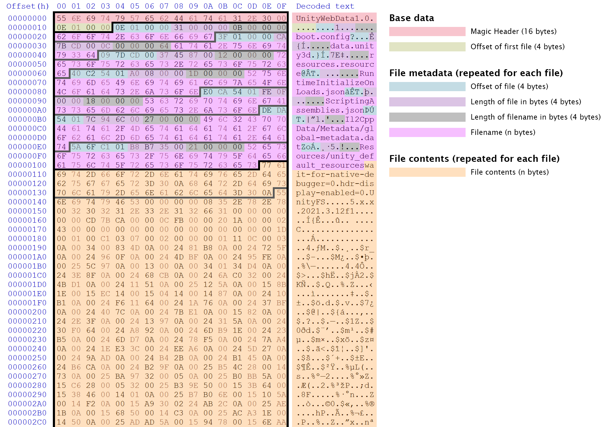

# unityweb

Command line utility and library for parsing, unpacking, and repacking Unity Web
data package files.

## Command Line Usage

### Installation

You can download a binary from the [releases page][releases-uri] or install the
package using Go:

```sh
go get github.com/jozsefsallai/unityweb
```

### Unpacking a Unity Web data package to a directory

```sh
unityweb unpack -i /path/to/unityweb.data -o /path/to/output/directory
```

### Packaging a directory into a Unity Web data package

```sh
unityweb pack -i /path/to/input/directory -o /path/to/unityweb.data
```

## Library Usage

```go
package main

import (
	"github.com/jozsefsallai/unityweb"
)

func main() {
	// you can now access functions from `unityweb`
}
```

### Unpacking a Unity Web data package to a directory

```go
pkg, err := unityweb.FromPackageFile("/path/to/unityweb.data")

if err != nil {
	panic(err)
}

err = pkg.Dump("/path/to/output/directory")

if err != nil {
	panic(err)
}
```

### Packaging a directory into a Unity Web data package

```go
pkg, err := unityweb.PackDirectory("/path/to/input/directory")

if err != nil {
	panic(err)
}

err = pkg.PackToFile("/path/to/unityweb.data")

if err != nil {
	panic(err)
}
```

## Unity Web package file structure reference

`.data` files used by Unity Web projects are just files stitched together with
no compression whatsoever and some added metadata for identification. Here's an
example that demonstrates the structure of these files:



## License

MIT.

[releases-uri]: https://github.com/jozsefsallai/unityweb/releases/latest
